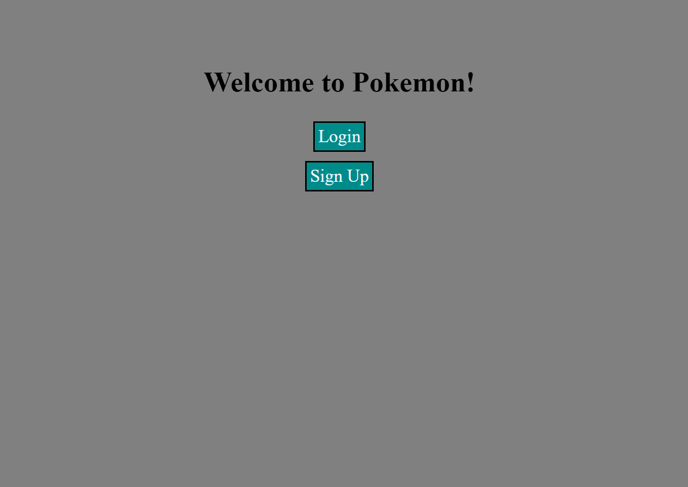
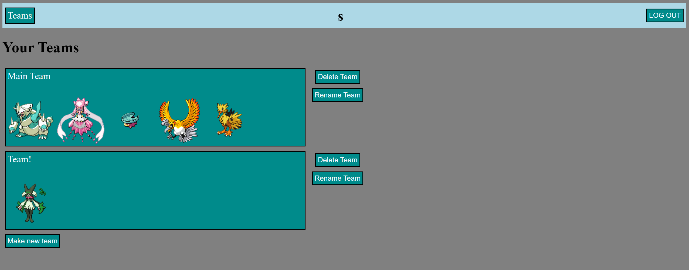
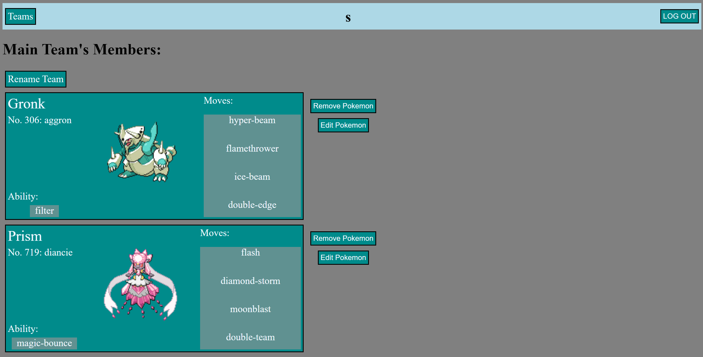
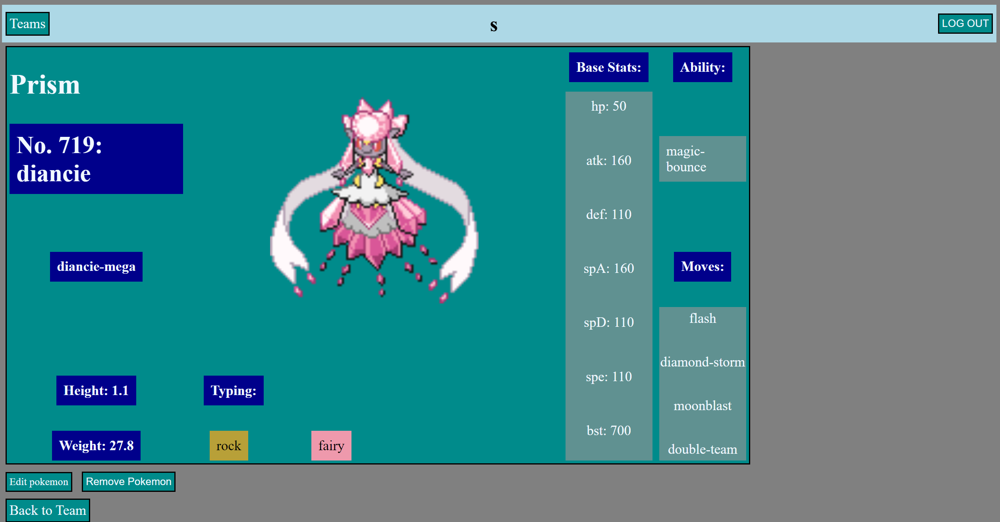

# PokeTeams
Welcome to PokeTeams! This website allows users to make multiple teams with each team having up to 6 Pokemon. Users can choose what Pokemon they can have on their team as well as give their Pokemon nicknames, make them shiny, change their form, etc. Pokemon's base stats, images, and other data are provided by PokeAPI. This website has full CRUD ability for both teams and the Pokemon on the teams.

# Getting Started

[Click to go to Website!](https://poketeams-project-2-aa7315a1faca.herokuapp.com/)

# Screenshot

### Home Page

### Teams Page

### Team Page

### Pokemon Page

# Technologies Used

- JavaScript
- HTML
- CSS
- Express
- Mongodb
- Mongoose
- Node.js

# Next Steps

- Add the ability for users to change the level of the pokemon
- Add the ability for users to change the starts of the pokemon